# PawTrack 🐾

PawTrack is a Flutter mobile app for busy dog owners who want a simple way to **remember walks, track exercise, and manage each dog's daily routine**.

It combines **real-time GPS tracking**, **weather advice**, **calendar reminders**, and **Firebase cloud accounts** so users can plan walks, review history, and keep each account's dog data safely separated.

<p align="center">
  
</p>

---

## Why PawTrack?

- keep all dogs in one place
- set a walk goal for each dog
- track real walks with GPS
- review history and 7-day stats
- get weather-based walking suggestions
- use account-based cloud sync so each user sees their own data

---

## Demo

**App Demo Video:** [Watch here](https://youtube.com/shorts/3p3pVw27iak?feature=share)

---

## Storyboard

The storyboard below shows the full PawTrack journey, from forgetting a walk to planning, tracking, reviewing, and securely managing personal dog data.

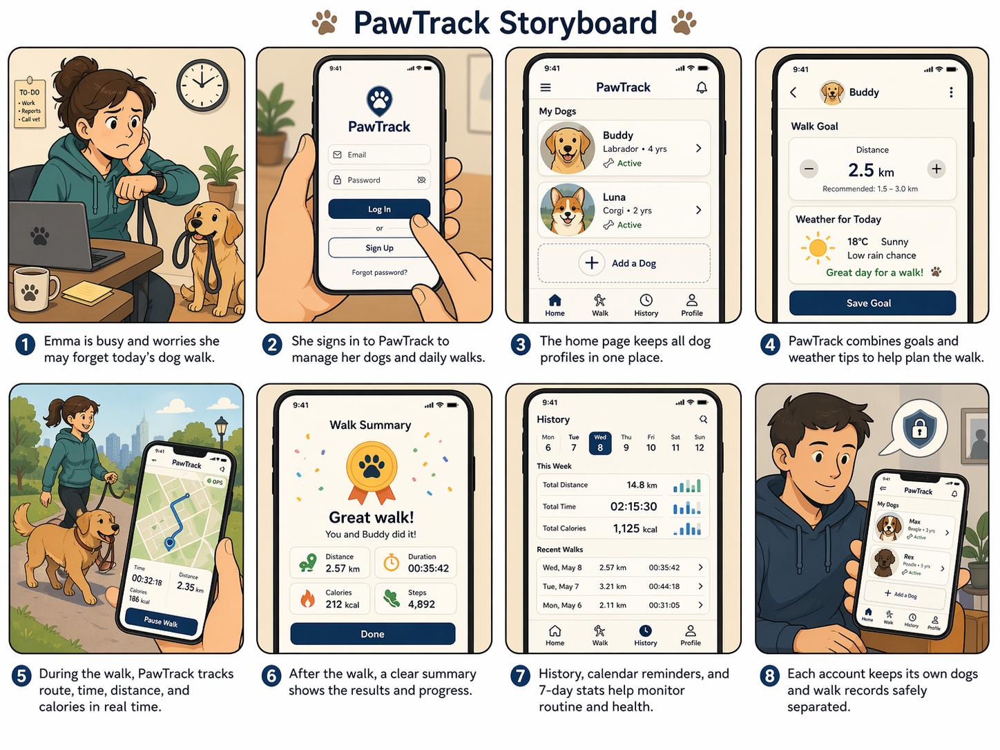

---

## Screenshots

### Splash & Authentication

<p align="center">
  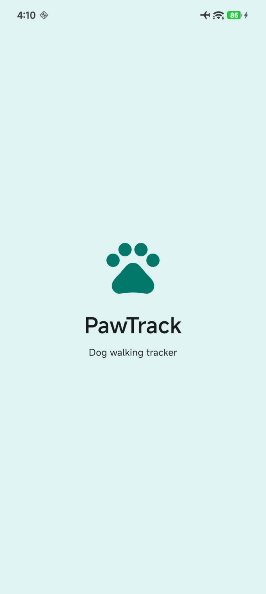
  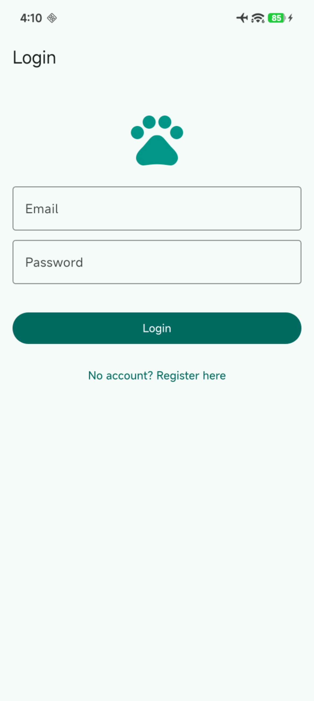
  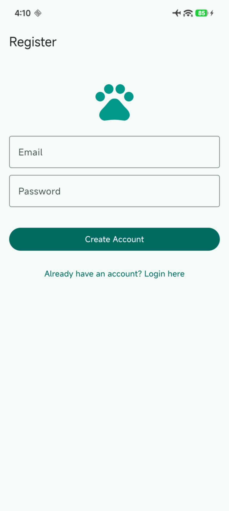
</p>

### Home & Dog Management

<p align="center">
  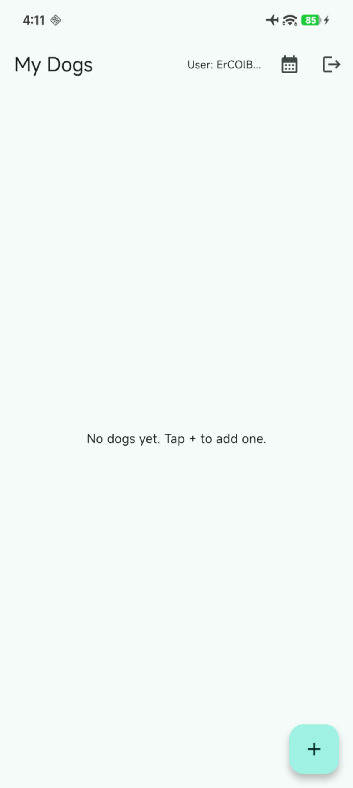
  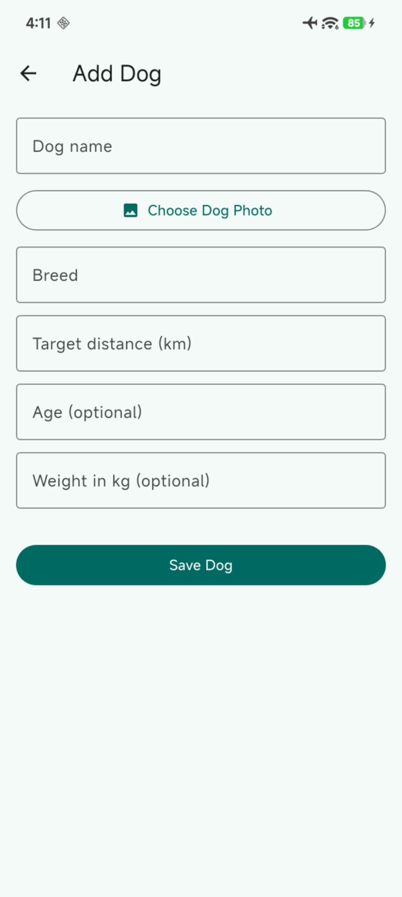
  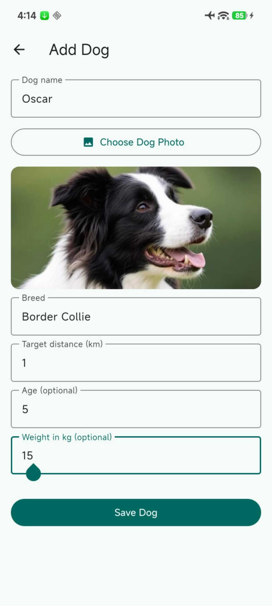
  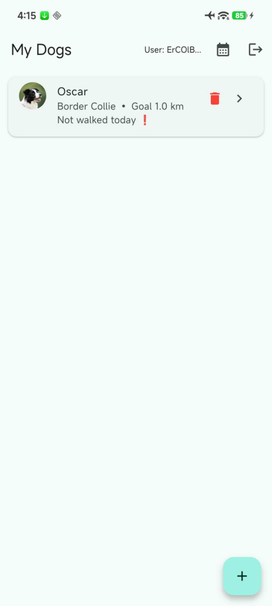
</p>

<p align="center">
  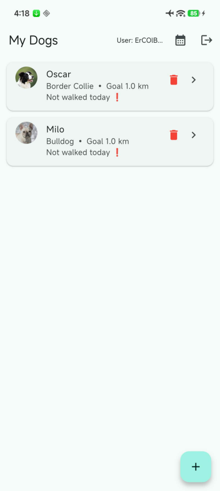
  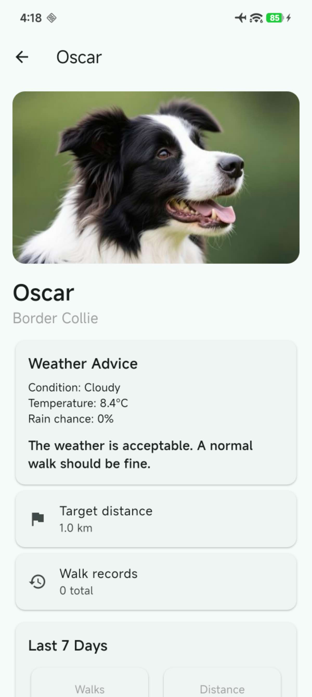
  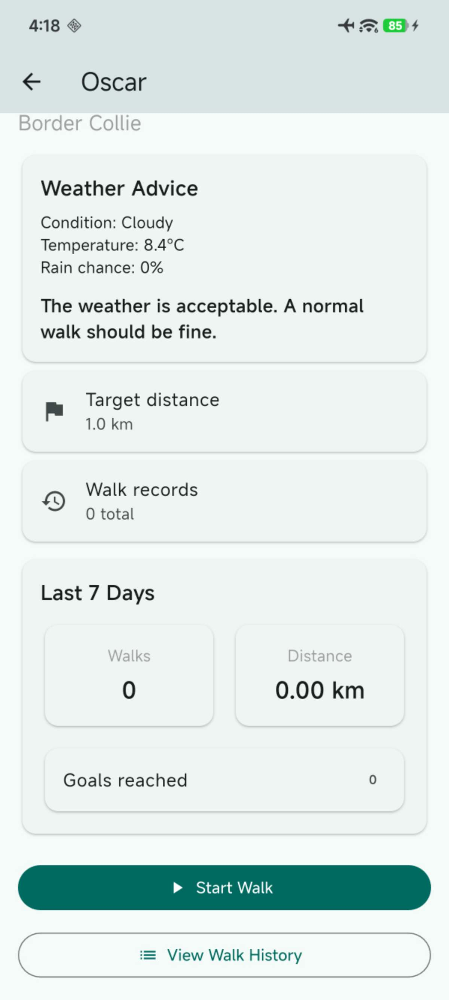
</p>

### Walking Experience

<p align="center">
  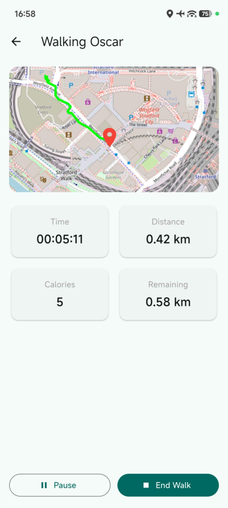
  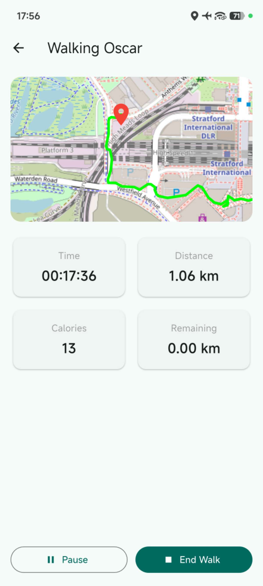
  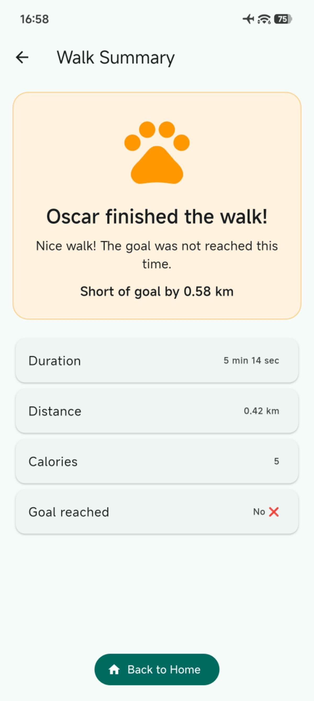
  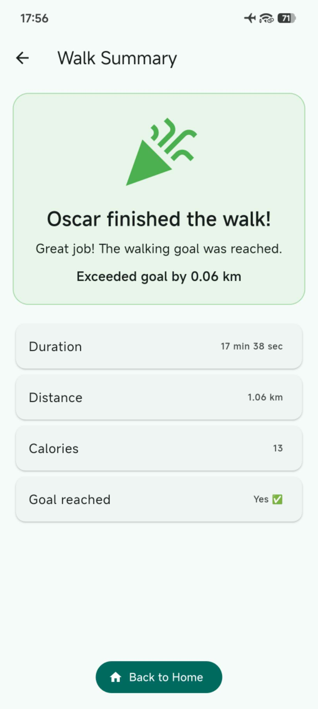
</p>

<p align="center">
  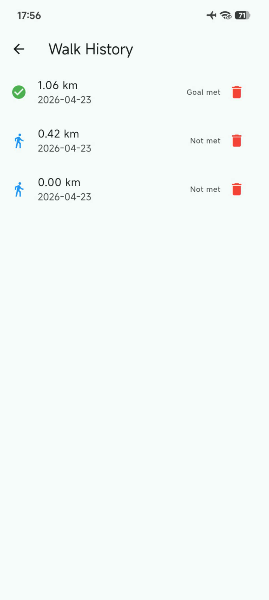
  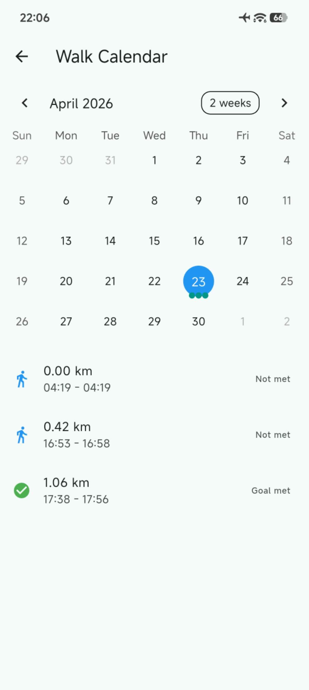
</p>

### Reminders

<p align="center">
  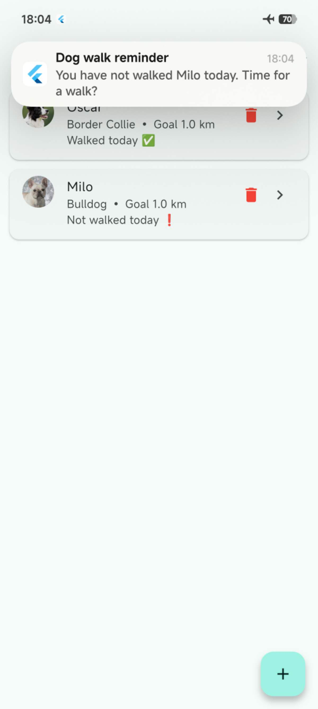
  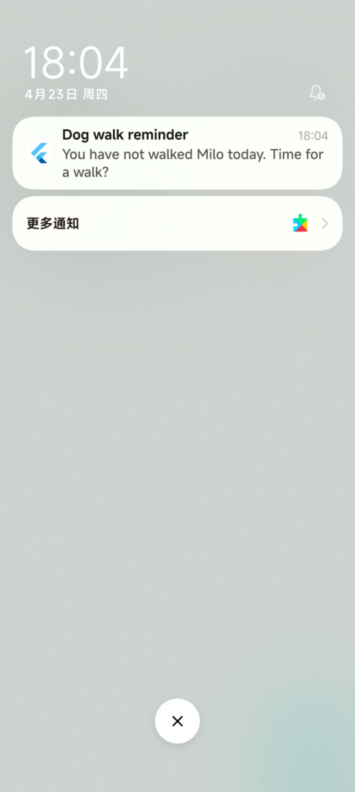
</p>

---

## Features

- Dog Profiles
- Real Walk Tracking
- Map & Route Replay
- Weather Advice
- Calendar & History
- Reminder Support
- Firebase Cloud Features

---

## Tech Stack

### Built With
- Flutter
- Dart
- Android Studio

### Packages / Libraries
- `geolocator` — GPS location tracking
- `flutter_map` + `latlong2` — live map and route display
- `hive` + `hive_flutter` — local storage
- `image_picker` — dog photo selection
- `table_calendar` — calendar view
- `flutter_local_notifications` — reminder notifications
- `http` — weather API requests
- `firebase_core` — Firebase setup
- `cloud_firestore` — cloud database
- `firebase_auth` — login / registration

---

## API & Service Integration

- **Open-Meteo API** — used to fetch live weather data and generate walking advice based on current conditions.
- **Firebase Authentication** — used for user registration, login, logout, and account-based access.
- **Cloud Firestore** — used to store dog profiles and walk records in the cloud with per-user data separation.

---

## Get Started

### Prerequisites

Make sure you have:

- Flutter SDK installed
- Dart installed
- Android Studio or VS Code
- an Android device or emulator
- a Firebase project configured for the app

### Installation

```bash
git clone https://github.com/ZiyiWang58/casa0015-mobile-assessment.git
cd casa0015-mobile-assessment
flutter pub get
flutter run
```

**Release APK:** [Download here](https://github.com/ZiyiWang58/casa0015-mobile-assessment/releases/tag/v1.0)

### Firebase Setup

PawTrack uses Firebase Authentication and Cloud Firestore.

To run the app correctly, configure your own Firebase project and generate the required FlutterFire files.

Typical setup steps:

- Create a Firebase project
- Enable Email/Password Authentication
- Enable Cloud Firestore
- Run FlutterFire configuration
- Make sure `firebase_options.dart` is included in the project
- Android Notes

If you run PawTrack on Android, make sure:

- location permissions are enabled
- notification permissions are enabled
- Google Play services are available on the device

---

## Contact Details

- Email: zczq912@ucl.ac.uk
